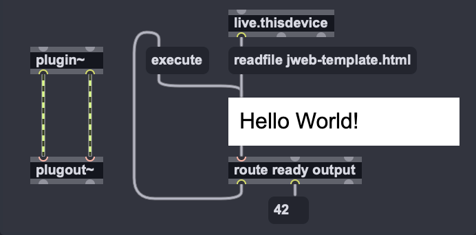
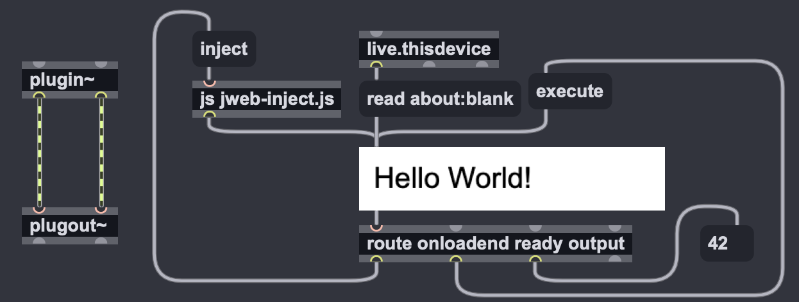

# ECMAScript Injection to `jweb` for M4L

## What is this?

An experimentation to use `jweb` object for developing Max for Live devices.

## Motivation

`jweb` object is an option for modern ECMAScript (JavaScript) in Cycling '74 Max before 9.
Also, `jweb` can be used to create UI with various APIs.<br>
However, as the author has researched, HTML files in frozen Max for Live devices cannot be loaded into `jweb`.

[Node for Max](https://docs.cycling74.com/max8/vignettes/00_N4M_index) (N4M) is another option, however, there are difficulties in using N4M in Max for Live. It is necessary to execute manually `npm install` to use external modules, it has to be executed only the first time.<br> 

`executejavascript` message is a way to inject some scripts to `jweb`.
You can handle long injection messages by `js` object as follows.

``` javascript
// jweb script injection by js object
autowatch = 1;
inlets = 1;
outlets = 1;

var      SCRIPT = "let label = document.createElement('label');";
SCRIPT = SCRIPT + "label.textContent = 'Hello World!';";
SCRIPT = SCRIPT + "window.document.body.appendChild(label);";
SCRIPT = SCRIPT + "window.max.bindInlet('execute', function() {";
SCRIPT = SCRIPT + "  window.max.outlet('output', 42)";
SCRIPT = SCRIPT + "});";
SCRIPT = SCRIPT + "window.max.outlet('ready');";

function inject() {
  outlet(0, 'executejavascript', SCRIPT);
}
```

Yeah, it is too hard to debug in development.

It would be useful to have an intermediate HTML as a template for development and extracting JavaScript like the above for the frozen M4L device from the template.

Among of ways to implement that demand, Python is a better tool because you would have prepared the environment for [Max diff tool](https://github.com/Ableton/maxdevtools/tree/main/maxdiff).

## Requirements

- Max 8.1 or later (see [this section](#meanwhile-max-9-has-arrived) for Max 9)
- Python 3.8 or later

## Usage

``` console
$ python3 jweb-inject.py [-i input-file] -o [output-file]
```
- `input-file` : the HTML template file. If not specified, it will be `jweb-template.html`.
- `output-file` : the name of the JavaScript file. If not specified, it will be `jweb-inject.js`.<br>
`-o` flag is necessary for the extract function.

## Sample M4L Device

See the [sample](sample/) directory.

## Getting Started

### Workflow

The workflow is as follows.


The Python script `jweb-inject.py` and HTML Template are the main factors.<br>
We will discusses each steps.

### 1. Prepare the Python Script

Just checkout this repository or download [the raw jweb-inject.py file]().

### 2. Prepare HTML Template

Copy the HTML file or just copy and paste from below.
``` html
<!DOCTYPE html>
<html>
  <head></head>
  <body>
    <script>
      window.onload = function() {
        /* @@@SOS@@@ */
        // insert your code here
        /* @@@EOS@@@ */
      }
    </script>
  </body>
</html>
```

Do not remove the comments `/* @@@SOS@@@ */` and `/* @@@EOS@@@ */`. Those indicate the start and end of your codes when generating the inject script.<br>

### 3. Prepare the Max Patch

Send `readfile [file name]` message to open the template HTML.

If you the HTML template in sample, `ready` message will be output and it can be a trigger to send initialize parameter to `jweb` or disable `hidden` attribute.



### 4. Modify ECMAScript in HTML Template

As you can see in [3. Prepare the Max Patch](#3-prepare-the-max-patch),
You can only write ECMAScript between indicators `@@@SOS@@@` and `@@@EOS@@@` and cannot add any tags of HTML.<br>
To display elements like text or input boxes, you have to write codes in WebAPI.

``` javascript
  const label = document.createElement('label');
  label.textContent = 'Hello World!';
  window.document.body.appendChild(label);
```

You can declare css like as follows.
``` javascript
  const style = document.createElement('style');
  style.textContent =
`body {
  font-family: Arial;
}
`;
  document.head.append(style);  
```

Also, you need to add handler functions for inlets of `jweb` object.
``` javascript
  window.max.bindInlet('execute', function() {
    window.max.outlet(42);
  });
```

It is good to output a message at the end of the script to indicate if the injection succeeded.<br>
``` javascript
  <script>
    window.onload = function() {
      /* @@@SOS@@@ */
      // ...
      // jweb outputs 'ready' message when injection succeeded.
      window.max.outlet('ready');
      /* @@@EOS@@@ */
    }
  </script>
```
It can trigger initializations in your patch such as sending `hidden 0` message showing `jweb` itself.

Again, do not remove the comments `/* @@@SOS@@@ */` and `/* @@@EOS@@@ */`.

### 5. Test and Fix ECMAScript in HTML Template

Import HTML file to Max for Live device.<br>
You can make any changes to the HTML for `jweb` while your `*.amxd` file is not frozen.

### 6. Extract JavaScript for `js`

Execute Python script to generate JavaScript file that injects scripts for `jweb`. 

``` console
$ python3 jweb-inject.py -i jweb-template.html -o jweb-inject.js
```

If you have not modified HTML template from the sample, the generated JavaScript is like below.
``` javascript
// generated by jweb-inject.py
// based on jweb-template.html
autowatch = 1;
inlets = 1;
outlets = 1;

var      SCRIPT = "let label = document.createElement('label');";
SCRIPT = SCRIPT + "label.textContent = 'Hello World!';";
SCRIPT = SCRIPT + "window.document.body.appendChild(label);";
SCRIPT = SCRIPT + "window.max.bindInlet('execute', function() {";
SCRIPT = SCRIPT + "  window.max.outlet(42)";
SCRIPT = SCRIPT + "});";
SCRIPT = SCRIPT + "window.max.outlet('ready');";

function inject() {
  outlet(0, 'executejavascript', SCRIPT);
}
```

### 7. Import JavaScript

Import the extracted JavaScript into your Max patch.
You have a few steps to inject to `jweb`.

#### 7.1. create `js` object that executes JavaScript.

#### 7.2. change initial message for `jweb` to `read about:blank`.
`about:blank` is the URL for a blank tab/page. In chromium, it is not completely blank but it has HTML elements like below.

``` html
<html>
  <head></head>
  <body></body>
</html>
```

#### 7.3. route `onloadend` message from `jweb` to `js`.
`jweb` outputs `onloadend about:blank` message when the load is completed.<br>
Route `onloadend` message to `js` to execute `inject` function.
Then `<script>` will be injected into loaded HTML body of `jweb`.

Modified patch is like below.



When the device is loaded, `live.thisdevice` sends `read about:blank` message except `readfile`.<br>
Then `jweb` object sends `onloadend` when a blank page is loaded and
`route` object fires `inject` function in `js` object.

[jweb-sample-release.amxd](sample/jweb-sample-release.amxd) is the actual result.

### 8. Freeze M4L Device

Just freeze as usual.<br>
Et voilà, you have a M4L device which has `jweb` content within itself.

Good luck!

## Notice

* The extracted JavaScript will not be minified.
* You must use single quot `'` for string literals in your HTML template. `jweb-inject.py` uses double quot `"` to inject scripts.
* As far as the author knows, there are no way to `import` other JavaScript in frozen M4L into the script in `jweb`.<br>
You can import modules from the Web like CDN, but be aware if your M4L device will always be used with the Internet and the license of external modules, off course.
* The author has not reported to the official that frozen M4L devices cannot load HTML files within themselves because it might be not the desired behavior.
* You can use `jweb` in MIDI Transform/Generate Tools, however, you cannot output dictionaries of transformed/generated notes to `live.miditool.out` directly. Because input and output within the apply cycle of MIDI Tool must be synchronized [like Node for Max](https://docs.cycling74.com/max8/vignettes/live_miditools#Limitations).<br>
Also, see details in [Memorandum of M4L development for MIDI Tools](https://github.com/h1data/M4L-MIDI-tool-examples/tree/main/memo#received-a-note-dictionary-asynchronously-make-sure-that-the-dictionary-is-synchronous).

## Meanwhile, Max 9 has arrived...

Max 9 introduced [`v8`](https://docs.cycling74.com/userguide/new_in_max9/#javascript-and-coding) object which can run modern ECMAscript.<br>
You may write directly ECMAscript with linter.<br>
This means you can inject it into `jweb` without intermediate templates as follows.
``` javascript
// this code is not confirmed to work
autowatch = 1;
inlets = 1;
outlets = 1;

targetFunction.local = 1;
function targetFunction() {
  let label = document.createElement('label');
  label.textContent = 'Hello World!';
  window.document.body.appendChild(label);
  window.max.bindInlet('execute', function() {
    window.max.outlet(42)
  });
  window.max.outlet('ready');
}

function inject() {
  outlet(0, 'executejavascript', targetFunction.toString());
}
```
It is not confirmed if Max 9 could handle HTML files in freezed M4L devices.
